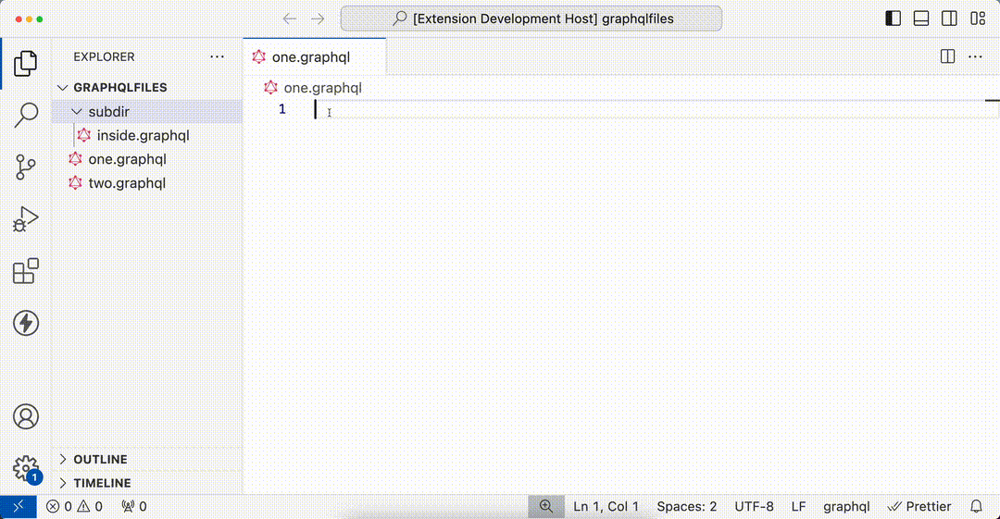

# VSCode GraphQL Import

A VSCode extension to improve the experience of using the #import directive in GraphQL files.

]

## TODO

- [x] Provide completions for graphql imports based on the filesystem as you are typing
- [x] Start suggesting files as soon as the initial quote is read - do not require a ./ to start
- [ ] Provide red squiggles if you've messed up an import declaration (e.g. you put a space between the hash and import, or are using single quotes when you should use double)
- [ ] Provide red squiggles if the file you're importing can't be found
- [ ] Provide the ability to toggle the types of quotes allowed: single, double, or both
